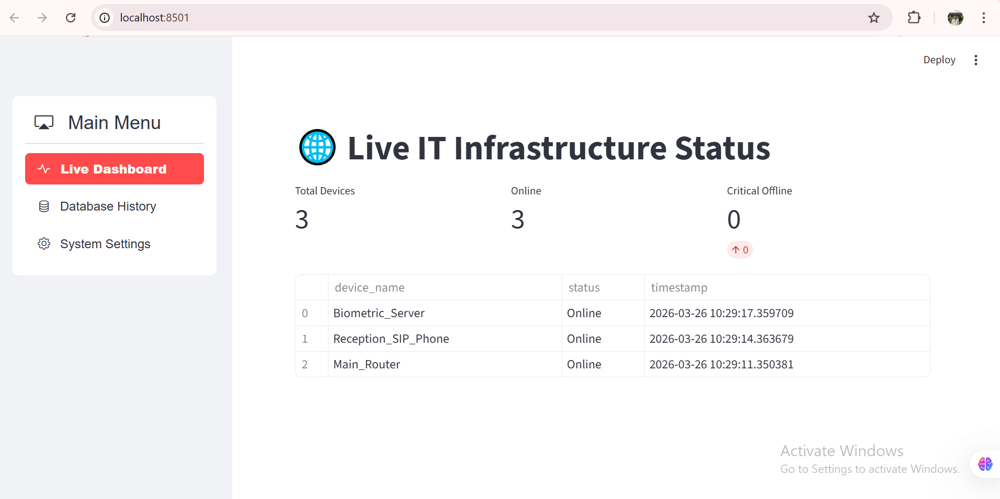
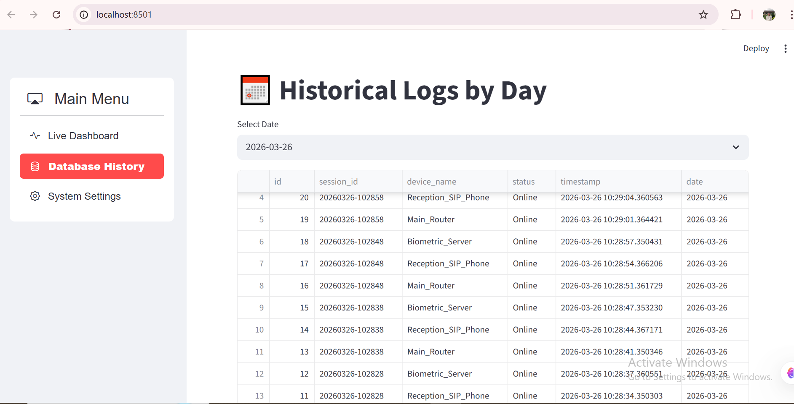

# Introduction 
  #### NetSentinel- Automated IT Infrastructure Health Monitor
- NetSentinel is a full-stack automation tool developed to bridge the gap between network administration and data analytics. It provides real-time health metrics for office
infrastructure, ensuring that hardware failures are detected and logged without human
intervention.
- NetSentinel transforms IT Support from a reactive task to a proactive strategy. By automating the
monitoring layer, IT teams can focus on high-level infrastructure optimization while ensuring 100%
visibility into the health of the office network.

##  Presentation

Detailed insights regarding the project's architecture, goals, and results can be found in the documentation below:
- 📄 [Project Presentation (PDF)](presentations.pdf)

##  How to Run System

Follow these steps to set up the environment and launch the application.

### Step 1: Open Terminal

Open your Command Prompt (CMD), PowerShell, or the integrated terminal in your IDE (like VS Code or PyCharm).

### Step 2: Install Dependencies and Launch

Run the following commands in order:

```bash
# Install the required libraries
pip install -r requirement.txt

# Run the data extraction script
python extract.py

# Launch the Streamlit web interface
python -m streamlit run app.py
```

> **Note:** Ensure you have Python 3.x installed and added to your system PATH before running the commands.

##  Output Screenshots

Below are the visual results and interface captures of the running system:

- Streamlit Dashboard Overview
- Final Results
- 
- 
